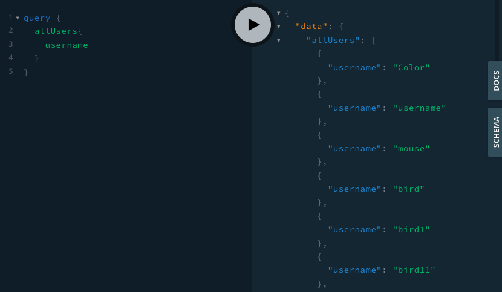
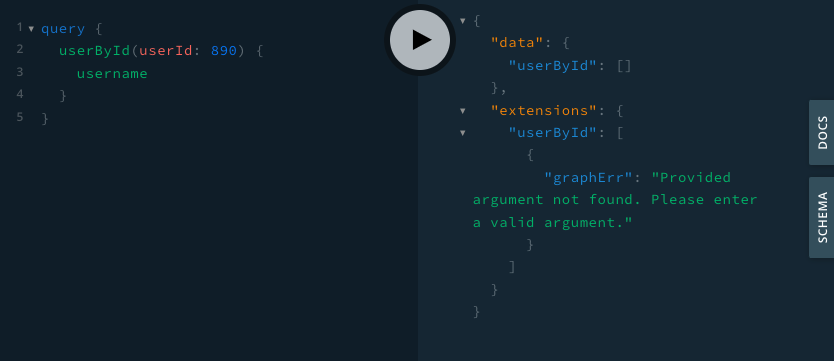
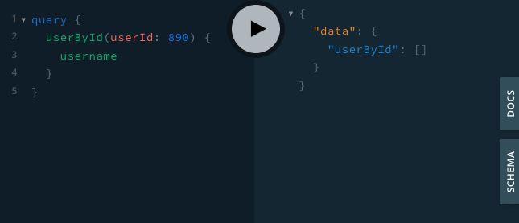
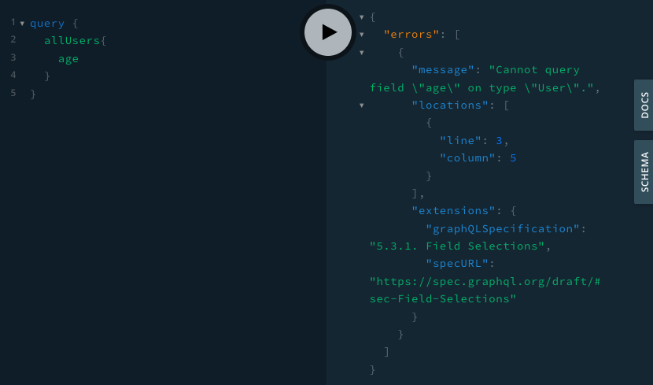
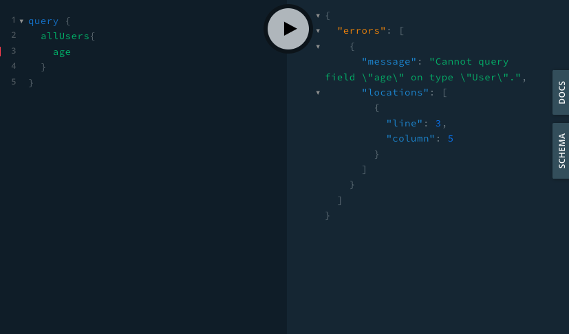

<div align="center">
  
</div>

## GraphErr

Descriptive GraphQL error handling for Deno/Oak servers.

## Features

* Provides additional context to GraphQL's native error messaging for faster debugging.
  * Classifies the error type and includes a link to the GraphQL spec for more information about the error.
* Gives descriptive error messagages to null responses, identifying the cause of the issue.
  * Traditionally, GraphQL null responses lack error messaging.
* Enables quick development of GraphQL-equipped router.
* Generates GraphQL Playground IDE, allowing developers to write and execute queries.

## Getting Started with GraphErr

Below is an example of a basic server you can use to run GraphErr. This server will run on http://localhost:3000/graphql by default.

```
import { Application, Router } from "https://deno.land/x/oak@v10.0.0/mod.ts";
import { applyGraphQL } from "./applyGQL.ts"
import { gql } from 'https://deno.land/x/graphql_tag@0.0.1/mod.ts';

const app = new Application();

// Define the GQL schema using GraphQL-tag (gql). More information on GraphQL-tag below in the README.
const typeDefs = gql`
  type Query {
    allUsers: [User!]!
  }
  type User {
    _id: ID!
    username: String!
    password: String!
  }
`;

// Define resolvers
const resolvers = {
  Query: {
    allUsers: () => {
      return [
      { _id: 1, username: 'JohnDoe', password: 'Password123!' }, 
      { _id: 2, username: 'JaneDoe', password: 'Password1234!!' }
      ]
    },
  },
};

const GraphQLService = await applyGraphQL<Router>({
  Router,
  typeDefs: typeDefs,
  resolvers: resolvers,
})

app.use(GraphQLService.routes(), GraphQLService.allowedMethods());

await app.listen({ port: 3000 });
```
* Please import all necessary 3rd party modules (graphErr, oak, and gql).
  * [Oak](https://github.com/oakserver/oak) is a middleware framework for handling HTTP requests.
  * [GraphQL-tag](https://github.com/apollographql/graphql-tag) (gql) is a Javascript template literal tag that parses GraphQL query strings into the standard GraphQL AST.
* Define typedefs (using GraphQL-tag) and resolvers and pass both into applyGraphQL as shown in the code above.
* ApplyGQL accepts four arguments:
  * Router: oak Router module
  * path?: string
    * A target path that handles the GraphQL post request (*optional: default as /graphql)
  * typeDefs: any
    * generated type tags by the gql
  * resolvers: any
    * An object that handles the queries and mutations
* ApplyGQL utilizes code from the Oak-GraphQL module. For additional information on ApplyGQL, please check out the [OakGQL repository](https://github.com/aaronwlee/oak-graphql).

## Making a Query

Here is an example query in the GraphQL playground:

```
query {
  allUsers {
    username
  }
}
```

The response would look like:

<div align="left">
  
</div>

## Functionality

Example #1 - graphErr response when the user receives an error (null response) that GraphQL does not natively provide error messaging for:

<div align="left">
  
</div>

Same query without graphErr: 

<div align="left">
  
</div>

<br />

Example #2 - graphErr response for a native GraphQL error:

<div align="left">
  
</div>

Same query without graphErr: 

<div align="left">
  
</div>

## Suggestions

We would love to hear from you!

GraphErr is currently in beta. If you would like to contribute please contact the authors.

Notice any issues or bugs? Please open an issue!

## Authors

[Thomas Seo](https://github.com/thomasseo1)

[Maxwell Cook](https://github.com/maxwellcook)

[Clay Sawyer](https://github.com/claysawyer)

[Loralyn Milcarek](https://github.com/loralyn-milcarek)

[Avi Kerson](https://github.com/avitacos)

## Documentation

[graphErr.land](https://www.grapherr.land/)

[Our medium article](google.com)
